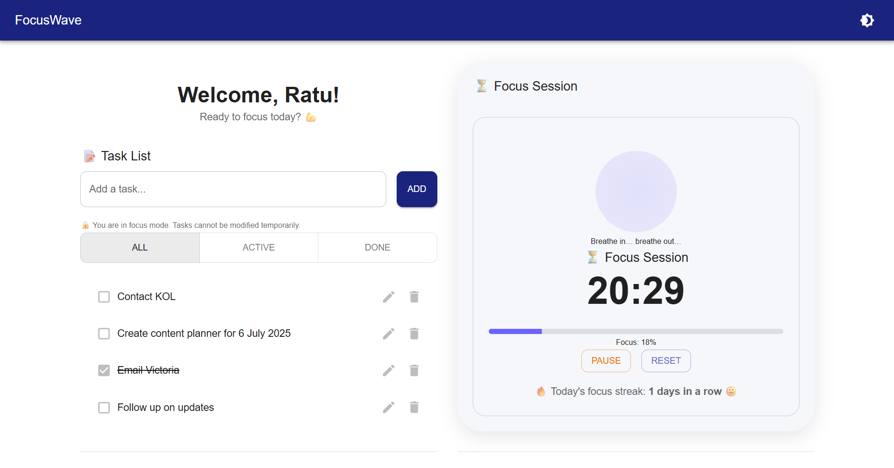
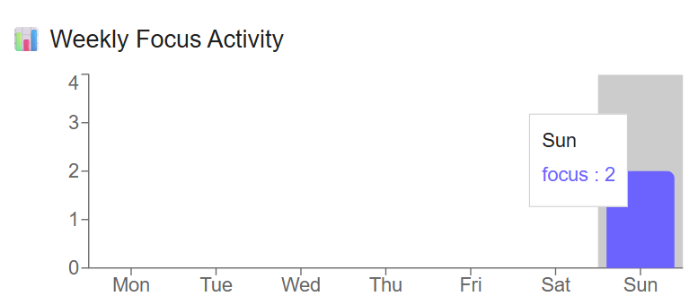

# FocusWave

**FocusWave** is a minimalist productivity web app designed to help you stay focused, manage tasks mindfully, and build strong daily habits through consistent focus sessions.

Built with React, MUI, and localStorage — FocusWave delivers a clean experience with modern design, streak tracking, and progress visualization.

---

## ✨ Features

- ✅ **Create, update, and delete tasks**
- ⏳ **Built-in focus timer** with lock mode during session
- 📈 **Streak counter** & weekly focus summary chart
- 🧘‍♀️ **Minimalist UI with light/dark mode toggle**
- 🎨 Custom branding with logo & gradient theming
- 💾 Fully local — no sign-up, no backend needed

---

## 📸 Screenshots

| Task List + Timer | Weekly Insights |
|-------------------|-----------------|
|  |  |

---

## 🛠️ Built With

- [React](https://reactjs.org/)
- [Material UI (MUI)](https://mui.com/)
- [Framer Motion](https://www.framer.com/motion/)
- LocalStorage (for streaks, tasks, sessions)
- SVG Icon + custom theme

---

## 📁 Project Structure

```txt
src/
├── component/ # Reusable UI components (Timer, Chart, Tasks, etc)
├── context/   # Theme context (dark/light mode)
├── hooks/     # Custom hooks (e.g. usePomodoroTimer, useFocusStats)
├── pages/     # Main app & landing page
├── store/     # State logic (actions for task/focus)
├── styles/    # Custom MUI theme
├── App.tsx    # Root app component
└── main.tsx   # Entry point
